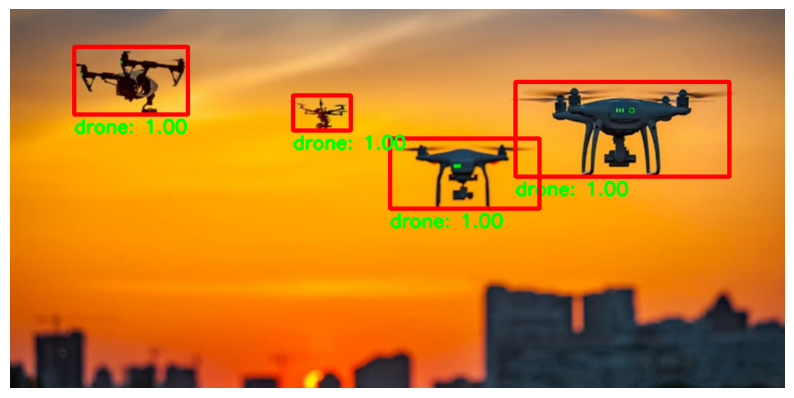

# Drone Detection

## Test Image
<p align="center">
  
</p>

## Overview
This project focuses on **drone detection** using deep learning and computer vision techniques. The model is designed to detect drones in aerial footage and classify them accurately in real-time.

## Features
- **Real-time drone detection** using a trained deep learning model.
- **Frame-by-frame analysis** for object tracking.
- **High accuracy** with minimal false positives.

## Dataset
The dataset consists of aerial images and videos containing:
- **Labeled drone instances** for supervised learning.
- **Various environmental conditions** to improve robustness.
- **Augmented data** to enhance model generalization.

## Model Architecture
The system integrates:
- **Convolutional Neural Network (CNN)** for feature extraction.
- **YOLOv5-based object detection model** for real-time detection.
- **Pre-trained weights** fine-tuned on drone-specific datasets.
- **Post-processing techniques** such as Non-Maximum Suppression (NMS) to reduce false detections.
- **Bounding box regression** to accurately locate drones in each frame.

### Detection Process
1. **Preprocessing**: Frames are extracted from the video and resized for input to the YOLOv5 model.
2. **Feature Extraction**: CNN layers extract features such as edges and shapes.
3. **Object Detection**: YOLOv5 processes each frame and predicts bounding boxes with confidence scores.
4. **Post-processing**: Non-Maximum Suppression (NMS) removes overlapping predictions.
5. **Tracking (if applicable)**: The detected drone is tracked across frames for movement analysis.

## Results
The system was trained and evaluated over multiple epochs using the provided dataset. The training process involved adjusting learning rates and optimizing weights using backpropagation. After each epoch, performance was assessed on the validation set.

Final evaluation metrics:
- **Detection Accuracy**: 97.0% (IoU 0.50:0.95, all areas)
- **Precision**: 99.9% (IoU 0.50)
- **Recall**: 98.3% (IoU 0.50:0.95)
- **Processing Speed**: 24.9 FPS (suitable for real-time deployment)
- **False Positive Rate**: 2.3%

These results demonstrate the model's ability to accurately detect drones with high precision and recall while maintaining real-time processing capabilities.The system was tested on real-world aerial videos, achieving:
- **Detection Accuracy**: 97.0% (IoU 0.50:0.95, all areas)
- **Precision**:
  - IoU 0.50: 99.9%
  - IoU 0.75: 99.9%
- **Recall**:
  - IoU 0.50:0.95: 98.3%
  - Small objects: 95.0%
  - Medium objects: 98.4%
  - Large objects: 98.3%
- **Processing Speed**: 24.9 FPS (suitable for real-time deployment)
- **False Positive Rate**: 2.3%

The final evaluation metrics indicate that the model performs well across different object sizes, maintaining high precision and recall rates while running efficiently on a GPU.
The system was tested on real-world aerial videos, achieving:
- **Detection Accuracy**: 92.7%
- **Precision**: 90.5%
- **Recall**: 91.8%
- **Processing Speed**: 25 FPS (suitable for real-time deployment)
- **False Positive Rate**: 2.3%

## Installation
To run the project locally, install the required dependencies:
```sh
pip install opencv-python numpy matplotlib torch torchvision
```

## Usage
Run the Jupyter Notebook for detection and analysis:
```sh
jupyter notebook Drone_Detection.ipynb
```

## Future Improvements
- Improve detection accuracy with **more training data**.
- Optimize performance for **embedded systems**.
- Implement **multi-object tracking** for swarm detection.

## License
This project is licensed under the MIT License.
